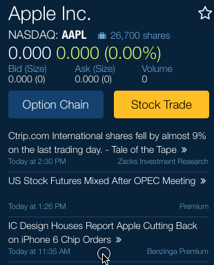
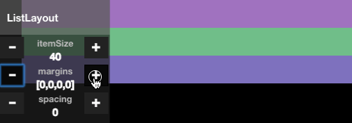
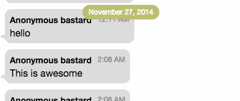
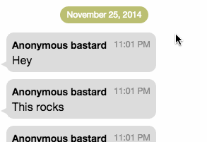

FlexScrollView
==========

# Index

- [Getting started](#getting-started)
- [Inserting & removing items](#inserting-removing-items)
    - [Auto event piping](#auto-event-piping)
- [Getting (visible) items](#getting-visible-items)
- [Flow mode](#flow-mode)
- [Margins & spacing](#margins-spacing)
- [Direction & alignment](#direction-alignment)
- [Pagination](#pagination)
- [Pull to refresh](#pull-to-refresh)
- [Sticky headers](#sticky-headers)
- [Collection layout](#collection-layout)
- [Embedded scrollviews](#embedded-scrollviews)
    - [Scrollview linking](asds)
    - [Horizontal & vertical scrolling restrictions](asds)

# Getting started

To use the FlexScrollView in your project, install famous-flex using npm or bower:

    npm install famous-flex

    bower install famous-flex

To create the FlexScrollView use:

```javascript
var FlexScrollView = require('famous-flex/ScrollView');

var scrollView = new FlexScrollView();
this.add(scrollView);
```

# Inserting & removing items

Inserting & removing items can be done in various ways.

Using the insert/remove functions which supports `autoPipeEvents` and animations through the use of `insertSpec` & `removeSpec`.

```javascript
scrollView.insert(0, new Surface({}));  // insert at the beginning
scrollView.insert(3, new Surface({}), {opacity: 0}); // insert after index 3, with fade-in effect
scrollView.insert(-1, new Surface({})); // insert after the end
scrollView.push(new Surface({}));       // insert after the end
scrollView.push(new Surface({}), {size: [0, 0]}); // insert with grow effect
scrollView.remove(0);                   // remove at index 0
scrollView.remove(-1, {opacity: 0});    // remove last item and fade-out
scrollView.removeAll();                 // removes all items
```

or using `setDataSource` or `sequenceFrom`:

```javascript
scrollView.setDataSource([surface1, surface2, ...]);
scrollView.sequenceFrom([surface1, surface2, ...]);

var viewSequence = new ViewSequence();
viewSequence.push(surface1);
viewSequence.push(surface2);
viewSequence.push(...);
scrollView.setDataSource(viewSequence);
scrollView.sequenceFrom(viewSequence);
```

## Auto event piping

When inserting renderables, you typically have to pipe the events from the renderable to the scrollview. This step can be done automatically for you by setting the `autoPipeEvents` option.

```javascript
var scrollView = new FlexScrollView({
    autoPipeEvents: true
});

// No need to call surface.pipe, the scrollview does this automatically for you.
scrollView.push(new Surface({
    content: 'My surface'
}));
```

**Note**: This only works when using the `insert`, `push`, `remove` and `removeAll` functions, and not when using `setDataSource` or `sequenceFrom`.

# Getting (visible) items


# Embedded scrollviews

## Horizontal & vertical scrolling restrictions

TODO

## Scrollview linking



The example above shows a scrollview embedded inside another scrollview. Whenever the bottom (news) scrollview reaches the top, it delegates the scroll-events to the outer scrollview, creating a seemless scrolling experience. To create this effect, set the `leadingScrollView` or `trailingScrollView` options in the constructor options:

```javascript
// Create outer scrollview
var scrollView = new FlexScrollView({
    autoPipeEvents: true
});
scrollView.push(new Surface{
    size: [undefined, 100],
    content: 'top surface'
});

// Add embedded scrollview
var embeddedScrollView = new FlexScrollView({
    autoPipeEvents: true,
    leadingScrollView: scrollView
});
scrollView.push(embeddedScrollView, undefined, false); // add, but don't pipe-events!
embeddedScrollView.push(new Surface{
    size: [undefined, 100],
    content: 'top surface'
});
```

Similarly, this can be done for the bottom part of scrollview. In that case, set the `trailingScrollView` option in the constructor:

```javascript
var embeddedScrollView = new FlexScrollView({
    trailingScrollView: scrollView
});
```

# Margins & Spacing (ListLayout)



Margins and spacing are part of the ListLayout that is selected into the scrollview by default. They can be set in the constructor or by using the `setLayoutOptions()` function:

```javascript
var scrollView = new FlexScrollView({
    layoutOptions: {
        margins: [10, 5, 0, 15], // margins in clockwise order: top, right, bottom, left
        spacing: 5
    }
});
```

Instead of specifying all margins separately, you can also use the shorthand notation:

```javascript
scrollView.setLayoutOptions({ margins: 5 }); // set all margins to 5
scrollView.setLayoutOptions({ margins: [5] }); // set all margins to 5
scrollView.setLayoutOptions({ margins: [5, 10] }); // set top/bottom to 5, left/right to 10
```

# Direction & alignment

Both X and Y directions are supported. By default, content is layed out in the Y-direction. To set the direction, use the constructor options or the `setOptions` function:

```javascript
var Utility = require('famous/utilities/Utility');
var scrollView = new FlexScrollView({
    direction: Utility.Direction.X // set direction to horizontal
});

scrollView.setOptions({
    direction: Utility.Direction.Y // direction & alignment can be changed on the fly
});
```

By default, renderables are aligned to the top (for direction: Y) and to the left (for direction: X). In some cases you may want to align the renderables to the bottom or the right. A good example of this is a chat application. When a keyboard is shown on a tablet or phone, it shifts the whole screen up. In this case you want to align the renderables to the bottom for when the screen is resized.

To set the alignment, use the `alignment` option. The alignment option can have two values, 0 (default) which aligns to the top or left, and 1 for aligning to the bottom or right.

```javascript
// create a vertical scrollview which is aligned to the bottom
var scrollView = new FlexScrollView({
    direction: Utility.Direction.Y,
    alignment: 1
});
```


# Sticky headers (ListLayout)



To enable sticky headers, set the `isHeaderCallback` layout-option to a function which returns `true` when a renderable is a section:

```javascript
var scrollView = new FlexScrollView({
    layoutOptions: {
        isHeaderCallback: function(renderNode) {
            return renderNode.isHeader;
        }
    }
```

A header is a regular renderable, just like any other renderable. In the following example we add a property `isHeader` so the header can be detected by the `isHeaderCallback()` function. Also, the renderable is moved in front so that it overlaps non-header items.

```javascript
function _createHeader() {
    var surface = new Surface({..});
    surface.isHeader = true;
    var renderNode = new RenderNode(new Modifier({
        transform: Transform.infront
    }));
    renderNode.add(surface);
    return renderNode;
}
```

To add headers & items, just add them in the order that you want them to be displayed:

``` javascript
scrollView.push(_createHeader());
scrollView.push(new Surface({}));
scrollView.push(new Surface({}));
scrollView.push(_createHeader());
scrollView.push(new Surface({}));
```

# Pull to refresh



To enable pull to refresh, assign a renderable to the `pullToRefreshHeader` or `pullToRefreshFooter` option:

```javascript
var scrollView = new FlexScrollView({
    pullToRefreshHeader: new Surface({
        size: [undefined, 50], // required
        content: 'pull to refresh header'
    }),
    pullToRefreshHeader: new Surface({...})
});
```

Whenever the user pulls on header or footer (the pull down height is 2x the height of the renderable), the `refresh` event is emitted:

```javascript
scrollView.on('refresh', function(event) {
    Timer.setTimeout(function() { // perform your refresh logic here

        // On completion, hide the pull to refresh header
        scrollView.hidePullToRefresh();
    }, 2000);
});
```

When using both header and footer pull to refresh, use `event.footer` to check which event was emitted:

```javascript
scrollView.on('refresh', function(event) {
    if (event.footer) {
        fetchNextPage(function() { // perform your logic here

            // when done, hide the pull to refresh footer
            scrollView.hidePullToRefresh(true);
        });
    }
    else {
        fetchPreviousPage(function() { // perform your logic here

            // when done, hide the pull to refresh header
            scrollView.hidePullToRefresh(false);
        });
    }
});
```

To programatically show or hide the pull to refresh renderables, use the following functions:

```javascript
scrollView.showPullToRefresh(footer);
scrollView.hidePullToRefresh(footer);
scrollView.isPullToRefreshVisible(footer);
```


To animate your pull to refresh renderable while pulling, create a custom view and implement the `setPullToRefreshStatus` on it. When pulling starts, stops or changes state, the FlexScrollView will call `setPullToRefreshStatus(state)` on the renderable to indicate these state changes.

See [famous-refresh-loader](https://github.com/IjzerenHein/famous-refresh-loader) for an example on how to create a responsive pull to refresh view.

Using RefreshLoader:
```javascript
var RefreshLoader = require('famous-refresh-loader/RefreshLoader');

var scrollView = new FlexScrollView({
    pullToRefreshHeader: new RefreshLoader({
        size: [undefined, 60],
        pullToRefresh: true,
        color: 'green'
        backgroundColor: 'white',
        particleCount: 8,
        particleSize: 7
    })
});
```
